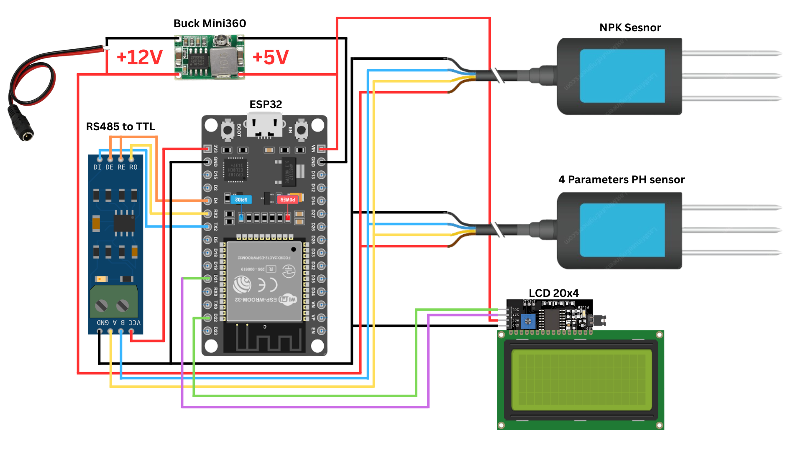
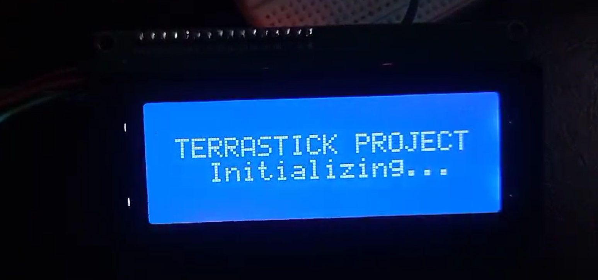
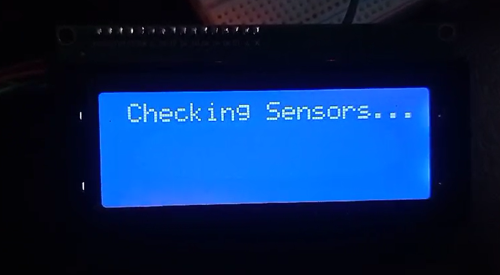
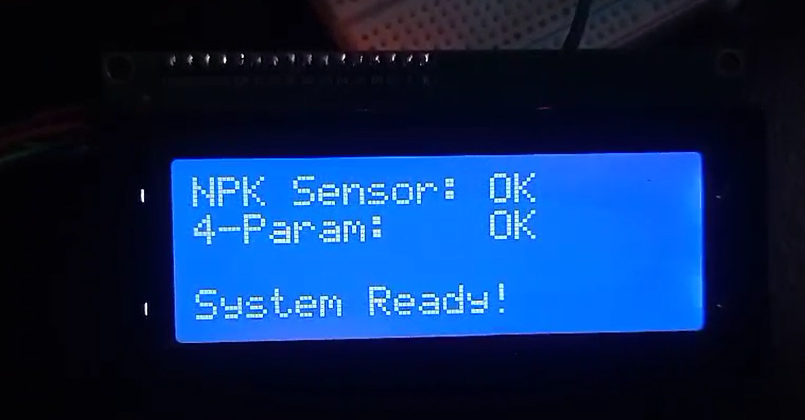
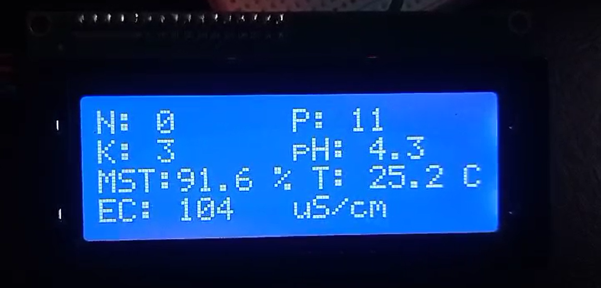

# TERRASTICK: Portable Soil Analysis Device

TERRASTICK is an ESP32-based portable soil analysis device that provides quantitative measurements for agricultural soil monitoring. It communicates with industrial RS485 soil sensors via the Modbus RTU protocol and displays real-time data on a 20x4 I2C LCD screen.

## Features
- **Measures 7 Parameters:** Nitrogen, Phosphorus, Potassium, Moisture, Temperature, EC, and pH.
- **Auto-Diagnostics:** Built-in startup check to verify sensor connectivity.
- **Live Error Detection:** Flashes screen warnings if a sensor disconnects during operation.
- **Clean UI:** Custom-padded 20x4 LCD grid layout to prevent ghost characters.
- **Hardware Validated:** Uses robust `HardwareSerial` on the ESP32 for uninterrupted communication.
- **Calibration Support:** Built-in floating point offset variables for easy fine-tuning.

## Components Required
- ESP32 Development Board
- RS485 to TTL Module (e.g., MAX485 or MAX3485)
- Soil NPK Sensor (RS485)
- Soil 4-Parameter Sensor (Moisture, Temp, EC, pH) (RS485)
- 20x4 I2C LCD Display
- 12V DC Power Supply (for the sensors)

## Wiring Diagram



### 1. MAX485 Module ➔ ESP32
| MAX485 Pin | ESP32 Pin | Notes |
| :--- | :--- | :--- |
| **VCC** | **3.3V** | ESP32 uses 3.3V logic. Powering the MAX485 from 3.3V is safer. |
| **GND** | **GND** | Common ground. |
| **RO** | **GPIO 16 (RX2)** | Receives data from the sensor. |
| **DI** | **GPIO 17 (TX2)** | Sends data to the sensor. |
| **DE & RE** | **GPIO 4** | Jumper DE and RE together. Switches module between Transmit/Receive. |

### 2. LCD Display ➔ ESP32

For reference, the physical build uses the following jumper wire colors:
* **Yellow:** SCL
* **Orange:** SDA
* **Red:** VCC (5V)
* **Brown:** GND


| LCD Pin | ESP32 Pin |
| :--- | :--- |
| **VCC** | **5V (VIN)** |
| **GND** | **GND** |
| **SDA** | **GPIO 21** |
| **SCL** | **GPIO 22** |

### 3. Sensors ➔ MAX485 & Power

For reference, the physical build uses the following extension wire colors to connect the sensors to the main board:
* **Soil 4-Parameter Sensor:** Green (GND), Yellow (A), Blue (B), Orange (VCC / 12V)
* **NPK Sensor:** Black (GND), White (A), Violet (B), (4th wire for VCC / 12V)


| Sensor Wire | Connection |
| :--- | :--- |
| **A (Yellow/Green)** | MAX485 `A` Terminal |
| **B (Blue)** | MAX485 `B` Terminal |
| **VCC (Brown/Red)** | 12V Power Supply (+) |
| **GND (Black)** | 12V Power Supply (-) **AND ESP32 GND** |

> **⚠️ CRITICAL: COMMON GROUND**
> The 12V Power Supply Negative (-) MUST be tied to the ESP32 GND, otherwise RS485 communication will fail.

## Folder Structure
* `/terrastick_sensors/`: The main ESP32 code. Upload this to run the device.
* `/change_address/`: A one-time utility script to change the Modbus Address of the 4-Parameter sensor from `0x01` to `0x02`. 

## Setup & Installation Instructions
1. Download the `LiquidCrystal I2C` library by Frank de Brabander via the Arduino Library Manager.
2. Out of the box, both sensors likely have the default Modbus Address of `0x01`. 
3. Wire up **ONLY** the 4-Parameter Sensor to the MAX485 module.
4. Flash the `change_address.ino` script to the ESP32. Check the Serial Monitor (115200 baud) to verify it successfully changed the address to `0x02`.
5. Now, wire **BOTH** sensors to the MAX485 module in parallel (A to A, B to B).
6. Flash the `terrastick_sensors.ino` script to your ESP32.
7. The system will boot, check both sensors, and seamlessly display the data on the LCD!

## How to Calibrate

If you notice your readings are slightly off (e.g., pH reads 6.5 in neutral 7.0 distilled water), you can easily calibrate the device using the built-in software offsets.

1. **Test your sensors** against a known baseline:
   - **pH:** Use distilled water (should be 7.0) or commercial pH calibration buffers.
   - **Moisture:** Dry air (should be 0%) and fully saturated soil (should be ~100%).
   - **Temperature:** Compare with a reliable room thermometer.
   - **EC:** Use distilled water (should be 0) or EC calibration liquid.
   - **NPK:** Compare against a chemical soil test kit or laboratory results.
2. **Calculate the difference:** If your sensor reads `6.7` in `7.0` water, your offset is `+0.3`.
3. **Update the code:** Open `terrastick_sensors.ino` and find the `CALIBRATION OFFSETS` section at the top of the file.
4. **Apply the offset:** Change `float CALIBRATE_PH = 0.0;` to `float CALIBRATE_PH = 0.3;`. 
5. **Flash the updated code:** The ESP32 will automatically apply these offsets to all future readings (and automatically prevents impossible negative values like negative moisture).

## Source Code

If you want to quickly copy-paste the main logic without cloning the repository, expand the section below to view the full Arduino code for `terrastick_sensors.ino`.

<details>
<summary><b>Click to expand the full Arduino Code</b></summary>

```cpp
#include <HardwareSerial.h>
#include <Wire.h>
#include <LiquidCrystal_I2C.h> // Important: Install "LiquidCrystal I2C" by Frank de Brabander in Library Manager

// Initialize the LCD. Address is usually 0x27 or 0x3F.
LiquidCrystal_I2C lcd(0x27, 20, 4); 

HardwareSerial modbusSerial(2);

const int RX_PIN = 16;
const int TX_PIN = 17;
const int RE_DE_PIN = 4;

// --- CALIBRATION OFFSETS ---
float CALIBRATE_N = 0.0;
float CALIBRATE_P = 0.0;
float CALIBRATE_K = 0.0;

float CALIBRATE_MOISTURE = 0.0;
float CALIBRATE_TEMP = 0.0;
float CALIBRATE_EC = 0.0;
float CALIBRATE_PH = 0.0;

// --- SENSOR 1: NPK (Address 1) ---
const byte npkQuery[] = {0x01, 0x03, 0x00, 0x1E, 0x00, 0x03, 0x65, 0xCD};

// --- SENSOR 2: 4-Parameter (Moisture, Temp, EC, pH) (Address 2) ---
const byte fourParamQuery[] = {0x02, 0x03, 0x00, 0x00, 0x00, 0x04, 0x44, 0x3A};

// --- GLOBAL SENSOR DATA ---
float final_n = 0, final_p = 0, final_k = 0;
float final_moisture = 0, final_temp = 0, final_ph = 0;
uint16_t final_ec = 0;

byte values[15]; 

void setup() {
  Serial.begin(115200);
  modbusSerial.begin(4800, SERIAL_8N1, RX_PIN, TX_PIN); 
  
  pinMode(RE_DE_PIN, OUTPUT);
  digitalWrite(RE_DE_PIN, LOW); // Start in listening mode
  
  // Initialize LCD
  lcd.init();
  lcd.backlight();
  
  // --- STARTUP SCREEN ---
  lcd.clear();
  lcd.setCursor(1, 1);
  lcd.print("TERRASTICK PROJECT");
  lcd.setCursor(3, 2);
  lcd.print("Initializing...");
  
  Serial.println("Starting TERRASTICK Sensors (NPK + 4-Parameter)...");
  delay(3000); // Give sensors time to warm up
  
  // --- SENSOR CHECK ---
  lcd.clear();
  lcd.setCursor(1, 0);
  lcd.print("Checking Sensors...");
  
  bool npkOk = readNPKSensor();
  delay(1000);
  bool paramOk = readFourParamSensor();
  
  lcd.clear();
  lcd.setCursor(0, 0);
  lcd.print("NPK Sensor: ");
  lcd.print(npkOk ? "OK" : "FAIL");
  
  lcd.setCursor(0, 1);
  lcd.print("4-Param:    ");
  lcd.print(paramOk ? "OK" : "FAIL");
  
  lcd.setCursor(0, 3);
  if (npkOk && paramOk) {
    lcd.print("System Ready!");
  } else {
    lcd.print("Check Wiring!");
  }
  
  delay(4000); // Hold status on screen for 4 seconds
  lcd.clear();
}

void loop() {
  Serial.println("\n--- Polling NPK Sensor (Address 1) ---");
  bool npkOk = readNPKSensor();
  
  delay(1000); // Give the bus a moment to settle
  
  Serial.println("\n--- Polling 4-Parameter Sensor (Address 2) ---");
  bool paramOk = readFourParamSensor();
  
  // Show the latest values (or last known good values) on the LCD
  updateLCD(); 
  
  // Check if any sensors failed to respond
  if (npkOk && paramOk) {
    // Both working fine, just wait normally before next poll
    delay(3000); 
  } else {
    // Hold the data on the screen for 2 seconds so you can still read it
    delay(2000); 
    
    // Now flash a warning on the LCD for 2 seconds
    lcd.clear();
    lcd.setCursor(0, 1);
    
    if (!npkOk && !paramOk) {
      lcd.print(" ERROR: ALL SENSORS ");
      lcd.setCursor(0, 2);
      lcd.print("   NOT RESPONDING   ");
    } else if (!npkOk) {
      lcd.print(" ERROR: NPK SENSOR  ");
      lcd.setCursor(0, 2);
      lcd.print("   NOT RESPONDING   ");
    } else if (!paramOk) {
      lcd.print("ERROR: 4-PARAM SENS ");
      lcd.setCursor(0, 2);
      lcd.print("   NOT RESPONDING   ");
    }
    
    // Hold the error message on screen for 2 seconds
    delay(2000); 
    
    // The loop will now restart, clear the error, and try polling again
  }
}

// Changed to bool so it can return true (success) or false (fail)
bool readNPKSensor() {
  digitalWrite(RE_DE_PIN, HIGH);
  delay(10);
  modbusSerial.write(npkQuery, sizeof(npkQuery));
  modbusSerial.flush();
  digitalWrite(RE_DE_PIN, LOW);
  delay(10);

  int index = 0;
  unsigned long startTime = millis();
  while ((millis() - startTime) < 1000) {
    if (modbusSerial.available()) {
      values[index++] = modbusSerial.read();
      if (index >= 11) break; 
    }
  }

  if (index == 11) {
    uint16_t n = (values[3] << 8) | values[4];
    uint16_t p = (values[5] << 8) | values[6];
    uint16_t k = (values[7] << 8) | values[8];
    
    // Apply calibration offsets and save to globals
    final_n = n + CALIBRATE_N;
    final_p = p + CALIBRATE_P;
    final_k = k + CALIBRATE_K;

    // Prevent values from dropping below zero
    if (final_n < 0) final_n = 0;
    if (final_p < 0) final_p = 0;
    if (final_k < 0) final_k = 0;

    Serial.printf("Nitrogen (N): %.0f mg/kg\n", final_n);
    Serial.printf("Phosphorus (P): %.0f mg/kg\n", final_p);
    Serial.printf("Potassium (K): %.0f mg/kg\n", final_k);
    return true; // Success!
  } else {
    Serial.printf("NPK Error: Received %d bytes (expected 11)\n", index);
    return false; // Failed
  }
}

// Changed to bool so it can return true (success) or false (fail)
bool readFourParamSensor() {
  digitalWrite(RE_DE_PIN, HIGH);
  delay(10);
  modbusSerial.write(fourParamQuery, sizeof(fourParamQuery));
  modbusSerial.flush();
  digitalWrite(RE_DE_PIN, LOW);
  delay(10);

  int index = 0;
  unsigned long startTime = millis();
  while ((millis() - startTime) < 1000) {
    if (modbusSerial.available()) {
      values[index++] = modbusSerial.read();
      if (index >= 13) break; 
    }
  }

  if (index == 13) {
    uint16_t rawMoist = (values[3] << 8) | values[4];
    int16_t rawTemp = (values[5] << 8) | values[6];
    uint16_t rawEC = (values[7] << 8) | values[8];
    uint16_t rawPH = (values[9] << 8) | values[10];

    // Calculate and apply calibration offsets
    final_moisture = (rawMoist / 10.0) + CALIBRATE_MOISTURE;
    final_temp = (rawTemp / 10.0) + CALIBRATE_TEMP;
    final_ec = rawEC + CALIBRATE_EC;
    final_ph = (rawPH / 10.0) + CALIBRATE_PH;

    // Prevent impossible negative values
    if (final_moisture < 0) final_moisture = 0;
    if (final_ec < 0) final_ec = 0;
    if (final_ph < 0) final_ph = 0;

    Serial.printf("Moisture: %.1f %%\n", final_moisture);
    Serial.printf("Temperature: %.1f C\n", final_temp);
    Serial.printf("EC: %d us/cm\n", final_ec);
    Serial.printf("pH: %.1f\n", final_ph);
    return true; // Success!
  } else {
    Serial.printf("4-Param Error: Received %d bytes (expected 13)\n", index);
    return false; // Failed
  }
}

// Function to cleanly format and update the 20x4 LCD in columns
void updateLCD() {
  char tempCol1[12]; // Temporary buffers for each column
  char tempCol2[12];
  char buffer[21];   // Buffer for the full 20-character line
  
  // Line 1: N and P
  sprintf(tempCol1, "N:%.0f", final_n);
  sprintf(tempCol2, "P:%.0f", final_p);
  sprintf(buffer, "%-10s%-10s", tempCol1, tempCol2);
  lcd.setCursor(0, 0);
  lcd.print(buffer);

  // Line 2: K and pH
  sprintf(tempCol1, "K:%.0f", final_k);
  sprintf(tempCol2, "pH:%.1f", final_ph);
  sprintf(buffer, "%-10s%-10s", tempCol1, tempCol2);
  lcd.setCursor(0, 1);
  lcd.print(buffer);

  // Line 3: Moisture and Temperature
  sprintf(tempCol1, "MST:%.1f%%", final_moisture);
  sprintf(tempCol2, "T:%.1fC", final_temp);
  sprintf(buffer, "%-10s%-10s", tempCol1, tempCol2);
  lcd.setCursor(0, 2);
  lcd.print(buffer);
  
  // Line 4: EC
  sprintf(tempCol1, "EC:%duS/cm", final_ec);
  sprintf(buffer, "%-20s", tempCol1); // Pad to 20 chars to clear the whole line
  lcd.setCursor(0, 3);
  lcd.print(buffer);
}
```
</details>

## Project Showcase

### 1. Prototyping
Here is the initial prototype built on a breadboard:


### 2. PCB Development
Moving the prototype to a soldered perfboard:


### 3. Final Assembly
The completed circuit board:


### 4. Working Device
The device successfully reading sensor data!


### 5. LCD Interface Flow
The sequence of the LCD screens during startup and operation:




